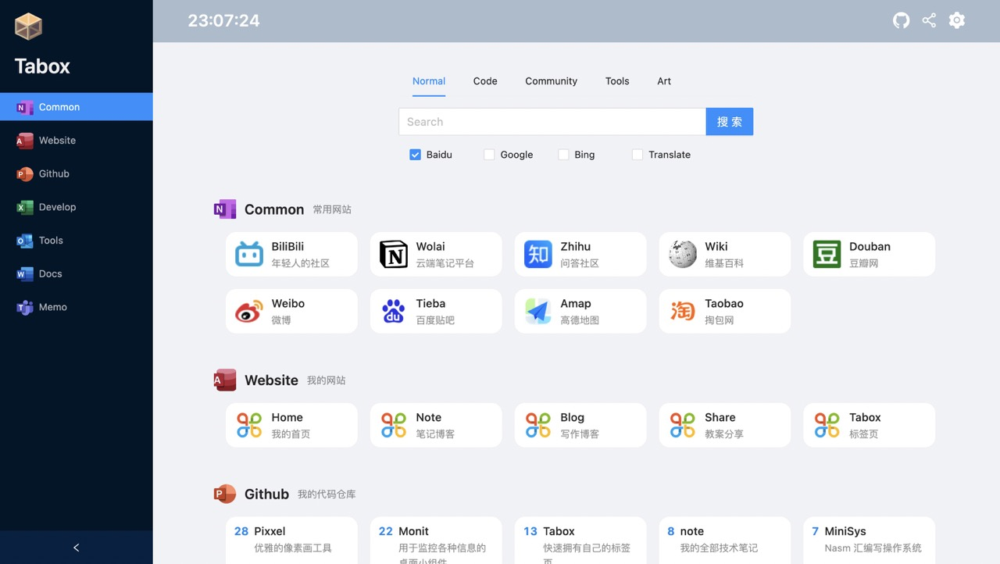

# 📦 Tabox

> 编写 yaml 配置文件，快速建立属于自己的标签页
>
> 预览：[https://tab.fzf404.top/](https://tab.fzf404.top/)
>
> 使用 React + Antd 开发



## 🚄 特性

- 支持多平台同时搜索
- 配置用户名即可加载该用户在 Github 中的所有项目
- 备忘录功能

## 🚀 快速开始

### 🎁 Github Pages
1. Fork 本项目
2. **切换到 `gh-pages` 分支**
3. 启用 Github Pages
4. 按照自己的喜好, 编辑 `config.yaml` 文件
5. 访问 Github Pages

### 💾 服务器

> 推荐使用 debian / ubuntu
```bash
# 0. 执行上方的操作

# 1. 安装 nginx / git
apt install git nginx -y

# 2. 切换到 nginx 目录
cd /var/www/html/

# 3. clone 项目的 gh-pages 分支
git clone https://github.com/fzf404/Tabox.git -b gh-pages --depth 1
# github 国内加速
git clone https://hub.fastgit.xyz/fzf404/Tabox.git -b gh-pages --depth 1

# 4. 访问
http://your_ip/Tabox/

```

### gist

> 使用 gist 作为配置文件
> 
> 待完成...